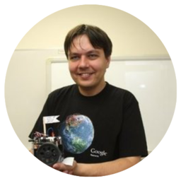

# 4C16

4C16/5C16 is course on Machine Learning (ML), with a focus on
Deep Learning. It is a fourth and fifth year module offered by the [Electronic &
Electrical Engineering](https://www.tcd.ie/eleceng/) department to the
undergraduate students of [Trinity College Dublin](https://www.tcd.ie).

Although Deep Learning has been around for quite a while, it has recently become
a disruptive technology that has been unexpectedly taking over operations of
technology companies around the world and disrupting all aspects of
society. When you read or hear about AI or machine Learning successes in the
news, it really means Deep Learning successes.

The course starts with an introduction to some essential aspects of Machine
Learning, including Least Squares, Logistic Regression and a quick overview of
some popular classification techniques.

Then the course dives into the fundamentals of Neural Nets, including
Feed Forward Neural Nets, Convolution Neural Nets and Recurrent Neural
Nets.

The material is constructed in collaboration with leading industrial
practitioners including Google, YouTube and Movidius, and students will have
guest lectures from these companies.

## Labs

We have designed a unique environment specifically for this course so
that students can learn best industry practices.

Our web platform can transparently connect students to a Google Cloud
Platform cluster via web based terminal/editor/Jupyter sessions. Labs
use the Keras framework and are automatically assessed using Git to
give immediate feedback.

Labs include designing and training various DNN for image
classification challenges, self driving car (simulator) and text
processing.

# Handouts

handouts and videos from last year an be found [here](https://frcs.github.io/4C16-2017)

## labs

It is recommended to students to refresh their knowledge of Python 3
prior to starting 4C16. Some useful resources are listed in the
document below:

* [Python 3 resources ](/handouts/PreparationPython3.pdf)

Hugh Denman's slides about python 3 and the 4C16 lab system is
available here:

* [pdf slides about lab system (intro)](/handouts/python_lab.no_notes.pdf)

George Sterpu is compiling a list of frequently asked questions & answers on his webpage:
* [F.A.Q.](https://georgesterpu.github.io/4c16.html)

## 00 - Introduction

* [pdf slides](/handouts/handout-00-intro.pdf)

## 01 - Linear Regression/Least Squares

* [pdf slides](/handouts/handout-01-linear-regression.pdf)
* [video (lecture 12/09/2018)](https://youtu.be/BKVqOmpYjas)
* no video for lecture 13/09/2018
* [pdf tutorial on linear algebra](/handouts/tutorial-00-linear-algebra.pdf)
* [pdf tutorial on least squares](/handouts/tutorial-01-linear-regression.pdf)
* [video (tutorial 17/09/2018)](https://youtu.be/VvPtJyy8v2I)

## 02 - Logistic Regression

* [pdf slides](/handouts/handout-02-logistic-regression.pdf)
* [video (lecture 24/09/2018)](https://youtu.be/K1WskVKmmVI)

## 03 - Know your classics

k-NN, Decision Trees, SVM and Kernel Trick

* [pdf slides](/handouts/handout-03-classic-classifiers.pdf)
* [video (lecture 24/09/2018)](https://youtu.be/DVMM8CcrBqE)
* [video about the Kernel Trick](https://youtu.be/aopHnnahrMI)

## 04 - Comparing Classifiers
* [pdf slides](/handouts/handout-04-evaluating-classifier-performance.pdf)
* [video (lecture 26/09/2018)](https://youtu.be/mH35PPUSmVE)
* [pdf tutorial](/handouts/tutorial-04-classifiers-evaluation.pdf)

## 05 - FeedForward Neural Networks
* [pdf slides](/handouts/handout-05-deep-feedforward-networks.pdf)
* [video (lecture 01/10/2018)](https://youtu.be/mzhRzlhrZf4)
* [video (lecture 03/10/2018)](https://youtu.be/MtR7Te39DMw)
* no video for lecture 04/10/2018

## 06 - Convolutional Neural Networks
* [pdf slides](/handouts/handout-06-convolutional-neural-networks.pdf)
* [video (lecture 08/10/2018) - CNN](https://youtu.be/nbcpeb6mpfk)
* [video (lecture 17/10/2018) - visualisation pt1](https://youtu.be/UGEeAKUyQXY)
* [video (lecture 18/10/2018) - visualisation pt2](https://youtu.be/zfipnfjZoLo)

## 07 - Advances in Network Architectures
* [pdf slides](/handouts/handout-07-advances-in-network-architectures.pdf)
* [video (lecture 18/10/2018)](https://youtu.be/yy8nYn1zvco)

## 08 - Text Processing
* [pdf slides](/handouts/handout-08-text-processing.pdf)
* [video (lecture 8/11/2018)](https://youtu.be/sWmaSn_dBkE)

# Keynotes

<table style="border: 0px">
  <tr>
  <td style="width:192px"></td>
  <td>
  <h3>Peter Barry (Jaguar Land Rover)</h3>
<h4> Automated Driving and AI </h4>

<em>Nov 1st 11-12am, Robert Emmet Theatre, Trinity College Dublin</em>

As Chief Software Architect Autonomous Driving Peter is a seasoned technical leader, with 27 years in development of distributed/embedded computing platforms. He currently leads the software team at Jaguar Landover responsibility for bringing Level 4 autonomy to Jaguar Landover’s products. Prior to this role, Peter
was a Senior Principal Engineer at Intel, where he  led the definition and development  of numerous products such as Intel's in vehicle  infotainment platforms and IoT Quark Product line. Peter has published two textbooks and holds 23 patents. 

</td>
</tr>
<tr>
<td style="width:192px"></td>
<td>
<h3>Professor Linda Hogan (TCD)</h3>
<h4>Ethics of Automation (title to be confirmed)</h4>

<em>Nov 21st 4-5pm, Jonathan Swift Theatre, Trinity College Dublin</em>

Professor Linda Hogan is an ethicist with extensive experience in research and teaching in pluralist and multi-religious contexts. Her primary research interests lie in the fields of inter-cultural and inter-religious ethics, social and political ethics, human rights and gender.
 

</td>
</tr>
<tr>
<td style="width:192px"></td>
<td>
<h3>Michaela Blott (Xilinx)</h3>
<h4>Machine Learning &amp; FPGAs (title to be confirmed)</h4>

<em>Nov 22nd 11-12am, Robert Emmet Theatre, Trinity College Dublin</em>

Michaela is Principal Engineer and Engineering Director at
Xilinx Ireland. She has over 20 years industry experience in FPGA and board-level
design and networking. Her main areas of interest include data
centers, high-level synthesis tools, high-speed network processing on
FPGAs (100Gbps and beyond). 

</td>
</tr>
<tr>
<td style="width:192px"></td>
<td>
<h3>George Toderici (Google Research)</h3>
<h4>Recent Advances in Neural Net Architectures (title to be confirmed)</h4>

<em> Nov 28th 5-6pm, Google Offices, Dublin</em>

George Toderici is Tech Lead / Manager at Google. He received his Ph.D. in Computer Science from the University of Houston in 2007 where his research focused on 2D-to-3D face recognition, and joined Google in 2008.
 He now leads a team that focuses on creating a new state of the art class of algorithms in the domain of lossy image compression and beyond. Prior to this, he designed deep learning methods for video classification, annotation, embedding models and more.
 

</td>
</tr>
</table>
